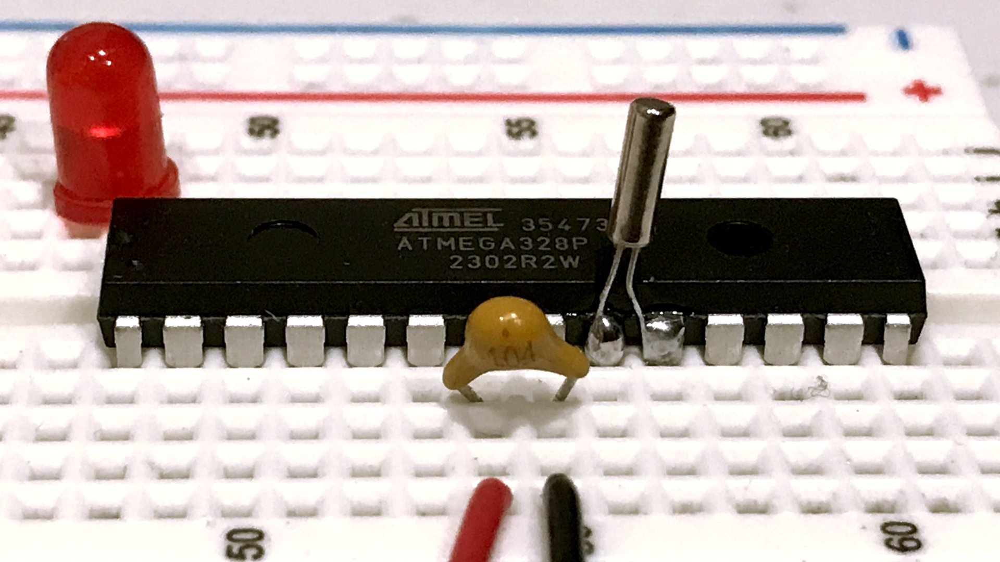
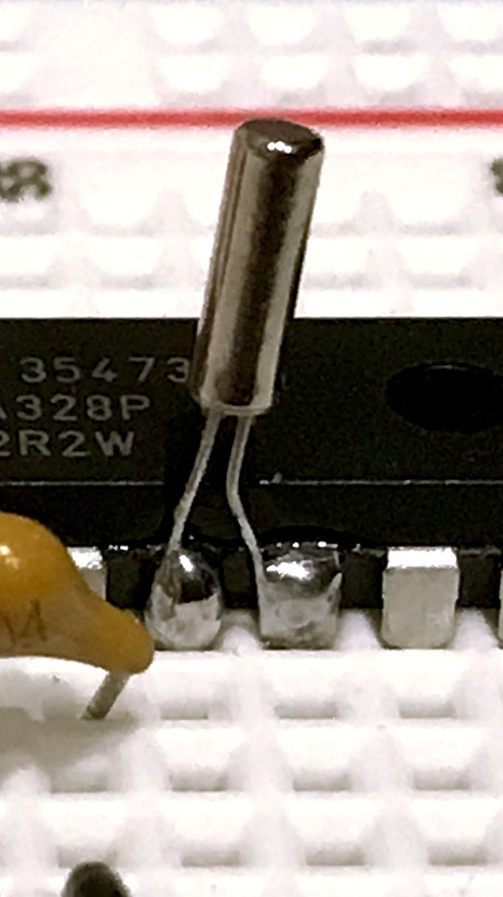

# ATmega328-Power-Save-Sleep-Solved



Learning the tricks to waking up a microcontroller with an inexpensive, 32768 Hz watch crystal. Discovering how the "asynchronous" mode of Timer/Counter 2 opens a path toward long battery life.

This article aims to interpret terse but thorough technical language found in the datasheet so that non-professionals can understand it, with a worked example.

### Introduction
Readers having a general knowledge of how and why to incorporate timer interrupts may want to skip ahead to [the next section](#what-makes-power-save-sleep-so-special).

```delay()``` has probably consumed more electricity in the past fifteen years than all of the other instructions given to Arduinos, combined.

It is a comfortable and convenient command for people learning to write code. The program obtains a desired result -- a pause before executing the next instruction -- just by naming it, without having actually to spell out the steps to do it. 

Those steps still exist of course, and must be carried out though they remain hidden inside the code that implements the delay.

The command certainly helps beginners when they first encounter an important concept about microcontrollers: automating the periodic repetition of a task. The beginner learns a pattern:

```
loop()		// do this part endlessly
{
  doSomething(); // perform a task
  delay();       // wait for some length of time
                 // repeat
}  
```

The convenience comes with a cost. The code inside ```delay()``` ties up the processor and expends electric current doing nothing.

When the delay lasts longer than the time it takes to do the "something", most of the current goes to waste. 

Projects designed to run on batteries need to eliminate the waste. One solution is to put the controller to sleep during the delay then wake it back up to perform the task. 

A timer interrupt provides the wake-up signal at regular intervals. 

The programmer adds a sleep instruction, a timer interrupt, and an Interrupt Service Routine (ISR) to the pattern.

```
setup()		// do this part once
{
  configureTimer();
  enableInterrupts();
}

loop()		// repeat this sequence endlessly
{
  doSomething();
  startSleeping();
}

ISR()
{
  stopSleeping();
}  
```

The timer configuration determines the length of time the processor will spend sleeping.

The processor does its task then goes to sleep in the loop. 

It wakes up in the ISR then quickly jumps back into the loop. 

It is beyond the scope of this article to explain timer interrupts. The example program demonstrates one. Many tutorials exist online.

The focus here is on choosing and implementing the right sleep mode.

### What Makes Power Save Sleep So Special
It can achieve the greatest reduction in power consumption from which the device can still wake itself autonomously with an internal timer interrupt.

Our target device is the ATmega328 or ATmega328P, the legacy microcontroller installed on Arduino Uno (through Rev 3) and Arduino Nano learning boards. I abbreviate the name, '328.

Five different sleep modes are available in the hardware of a '328. All of them reduce power consumption to some degree by turning off selected parts of the device. 

The most extreme mode, Power Down, turns off everything except the tiny bit that senses an external signal on one of the I/O pins. 

Power Down is the mode to use when the controller must respond to external events as they occur, but does not need to do anything at predetermined intervals.

In this most thrifty mode, the device can reduce power consumption to about 1/10th of a *micro*Amp of current. That is 1/100,000th of the 10 *milli*Amps rate at which the same processor drains the juice during a ```delay()``` on a 5-volt Arduino roaring along at 16 MHz. 

Unfortunately, we cannot wake up from Power Down sleep by means of an internal timer because it turns off the timers.

Power Save sleep mode is the next best thing. When combined with a 32 KHz watch crystal and Timer/Counter 2, it can reduce the operating current of a '328 to near 1.5 *micro*Amps. That's still a very low rate of current. 

The technique described here solders a 32kHz watch crystal onto the XTAL pins of a '328. So modified, the controller needs no other, additional, external Real Time Clock device to wake it up periodically.

### What It Would Help Readers to Know Already
This article addresses readers having an intermediate level of prior knowledge and experience with:

* assembling and soldering electronic components;
* the ATmega328(P) datasheet, available online from Microchip, its manufacturer, [here](https://ww1.microchip.com/downloads/aemDocuments/documents/MCU08/ProductDocuments/DataSheets/ATmega48A-PA-88A-PA-168A-PA-328-P-DS-DS40002061B.pdf); 
* writing code directly addressing memory locations named in the datasheet;
* using the AVRDUDE utility plus an ICSP programmer to upload code into a bare controller.

### Preparing the Controller

#### 32K Watch Crystal



Solder one of these little cylindrical devices onto the TOSC1 and TOSC2 pins (pins 9 and 10 on the DIP28 version of a '328.) The capacitance of the crystal should be 12.5 pf or less. Those of 12.5 pf are fairly easy to procure inexpensively. Their Equivalent Series Resistance should not exceed 30 kOhms. I have not needed to add external capacitors with these 32k crystals. The datasheet indicates that the '328 implements the necessary components internally.

Please do solder their tiny legs onto the pins, however. It won't work reliably to poke the tiny leads into a breadboard.

#### Fuses

Accept (or restore) the default fuse settings as they come in new '328s from Microchip. They are:

| Fuse | Value | Remark |
| ---- | ----- | ------ |
| Extended | ```0xff``` | Disables the Brown-Out Detector |
| High | ```0xd9``` | Allows the Watchdog Timer to be turned off at run-time |
| Low | ```0x62``` | Selects the 8 MHz Internal Calibrated Oscillator |

I use the *avrdude* utility to manage the fuses. 

#### System Clock Speed
After setting the low fuse byte to select the internal oscillator, two registers control the actual operating speed: the system clock prescaler register, CLKPR; and the oscillator calibration register, OSCCAL.

##### Prescaler
First, ensure that the oscillator frequency passes through the System Clock Prescaler without reduction by writing the CLKPS3:0 bits to logic level 0. Observe the timed sequence spelled out on pages 46-47 of the datasheet.

```
   CLKPR = (1<<CLKPCE); // set the Clock Prescaler Change Enable bit
   CLKPR = 0;           // clear the CLKPS3:0 bits
```

##### Calibration
Second, optionally, write a value to the OSCCAL register to calibrate the oscillator's frequency. Microchip puts a default value in there which may bring the oscillator to somewhere between 7.2 MHz and 8.8 MHz. Thankfully, we can fine-tune it rather precisely. See discussion on pages 43, 46 and Figures 31-368 through 31-370 on pages 520-521 in the datasheet.

I found an oscilloscope very helpful for measuring the frequency of the system clock. Writing logic level "0" to the CKOUT bit in the low fuse byte directs the clock's square wave onto the CLKO pin, which is pin 14 on the DIP28 package of a '328. Restore the CKOUT bit to "1" to regain use of the xx pin for I/O purposes.

Calibrating the internal oscillator is not demonstrated in the example program because not needed; the 32 KHz crystal regulates the time-critical part of it.

### Select the crystal source for Timer 2

Writing the AS2 bit in the Asynchronous Status Register, ASSR, to logic level 1 selects the crystal to be the clock source for Timer/Counter 2. Plan to turn on the power to Timer 2, and to disable its interrupts first.

```
  PRR &= ~(1<<PRTIM2);          // enable power to TC2
  TIMSK2 = 0;                   // disable TC2 interrupts  
  ASSR = (1<<AS2);              // switch to asynchronous mode
```

#### Update relevant Timer 2 registers
Important! Switching into (or back from) asynchronous mode affects five other registers in the Timer/Counter 2 peripheral. 

Plan to re-write the Counter, two Control registers and two Compare registers after the change. Writing zeros will serve the purpose. The example goes ahead and selects a prescaler value in Control Register B at this point.

```
  TCNT2 = 0;		// start count at zero
  TCCR2A = 0;		// normal mode
  TCCR2B = 
    0b00000<<3;		// normal mode, plus
       | 0b101;		// the clock-select bits for the /128 prescaler 
  OCR2A = 0;		// not used, but clear it anyway
  OCR2B = 0;		// not used, but clear it anyway
```

See pages 165-166 in the datasheet for details of the clock select bits. The prescaler value will be discussed further, below.

#### Synchronize When Setting Up the Timer**

When Timer 2 is being clocked by the 32k crystal, it runs independently of the system clock. The two clocks' signals rise and fall at different speeds and at different times. The differences impose necessary delays when writing to or reading from certain registers in the Timer 2 peripheral. 

As I understand it, the delays last until the two clocks "synchronize" for an instant. This occurs upon the first or second subsequent rising edge on the TOSC1 pin attached to the crystal oscillator. Your code must allow for the delays.

Five of the bits in the Asynchronous Status Register, ASSR, give indication when writes to the five registers mentioned above have not yet synchronized. I will refer to them as the "sync bits". The sync bits become clear (logic 0) after the writes take effect and it is safe to proceed.

```
  while (ASSR & 0b00011111) { ; /* wait */}
```

##### Now, Wait a Second!
Allow a full second to elapse after first entering asynchronous mode, giving the crystal time to stabilize. This pause is needed only once, after powering-up or resetting the '328.

We can measure the pause using Timer 2.

The example "prescales" the Timer 2 clock by dividing the crystal frequency, 32768 Hz, down to a lower speed. The selected divisor is 128. 32768 / 128 = 256 "clock ticks" per second. 

It means the Timer's counter register will increment from zero up to 255 during one second. As an 8-bit register, it will "overflow" to 0 at the next tick of its prescaled clock. This event raises the Timer's Overflow Flag.  

```
  TIFR2 = (0b111<<TOV2);        // clear T2 interrupt flags
  /* wait one second while the crystal gets up to speed */
  while ( ! (TIFR2 & (1<<TOV2)) ) { ; /* wait */ }
```

The flag goes to logic 1 when the overflow occurs.

#### Enable the Timer 2 Interrupt
The Overflow Flag can trigger an interrupt as well, if interrupts are enabled.

The example enables the Timer 2 Overflow interrupt.

```
  TIFR2 = (0b111<<TOV2);        // clear T2 interrupt flags again
  TIMSK2 = (1<<TOIE2);          // enable T2 overflow interrupt
  sei();                        // enable interrupts globally
```

We are almost ready to start the fun. But first, a simple precaution.

#### Synchronize Before Sleep
I am going to recite some text from the datasheet, then interpret what I think it means in practical terms.

>When entering Power-save or ADC Noise Reduction mode after having written to TCNT2, OCR2x, or TCCR2x, the user must wait until the written register has been updated if Timer/Counter2 is used to wake up the device. Otherwise, the MCU will enter sleep mode before the changes are effective... If the write cycle is not finished, and the MCU enters sleep mode before (it finishes), the device will never receive a compare match interrupt, and the MCU will not wake up.

There's more.

>If Timer/Counter2 is used to wake the device up from Power-save or ADC Noise Reduction mode, precautions must be taken if the user wants to re-enter one of these modes: If re-entering sleep mode within the TOSC1 cycle, the interrupt will immediately occur and the device wake up again. The result is multiple interrupts and wake-ups within one TOSC1 cycle from the first interrupt. If the user is in doubt whether the time before re-entering Power-save or ADC Noise Reduction mode is sufficient, the following algorithm can be used to ensure that one TOSC1 cycle has elapsed:
a) write a value to TCCR2x, TCNT2, or OCR2x; b) wait until the corresponding Update Busy Flag in ASSR returns to zero.

What this comes down to in my mind is to perform the synchronization wait prior to every entry into sleep mode. The example does this by writing to the OCR2B register, which otherwise plays no role in the program.

```
  /* verify TC2 is ready for sleep, see datasheet section 18.9 */
  OCR2B = 0;  // write an arbitrary value to this unused register
  while (ASSR & OCR2BUB) { ; /* wait for the update bit to clear */ }
```

Now at last we are ready to enter Power Save Sleep mode.

```
  SMCR |= (0b0111<<SE);        // enable sleep in Power-Save mode
  asm volatile ("sleep \n\t");
```

My personal coding style preference is to place those instructions at the end of the ```loop()``` code block. I put the repetitive task code at the top of the ```loop()``` where it will be executed the first time through and then again every time the processor returns from sleeping.

#### Synchronize Yet Again After Sleep
Comes now a key trick that eluded me for a long and puzzled time. I was getting interrupts that would wake up the processor. But it seemed I might be getting more than one interrupt in rapid succession. Something like that was confusing my programs, preventing them from processing their periodic tasks correctly.

The datasheet attempts to explain the wake-up phase this way:

>Description of wake up from Power-save or ADC Noise Reduction mode when the timer is clocked asynchronously: When the interrupt condition is met, the wake up process is started on the following cycle of the timer clock, that is, the timer is always advanced by at least one before the processor can read the counter value. After wake-up, the MCU is halted for four cycles, it executes the interrupt routine, and resumes execution from the instruction following SLEEP... The phase of the TOSC clock after waking up from Power-save mode is essentially unpredictable, as it depends on the wake-up time... During asynchronous operation, the synchronization of the Interrupt Flags for the asynchronous timer takes 3 processor cycles plus one timer cycle. The timer is therefore advanced by at least one before the processor can read the timer value causing the setting of the Interrupt Flag. 

Hmm...

I concluded that synchronization appears necessary again as the processor wakes up in the Timer 2 interrupt service routine (ISR). However in this situation, rather than write to a register and wait for the sync bits to clear, I found it effective to follow this sequence:

```
  /* disable sleep mode routinely upon waking up */
  SMCR = 0;
  /* wait for the timer to count up to 3 */
  while (TCNT2 < 3) { ; }
```

The wait appears to allow the timer to synchronize with the system clock sufficiently to resolve the interrupt flags properly. To be honest, I cannot explain it better than that.  

Those are the secrets that I dug out of the datasheet for Power Save Sleep with an asynchronous Timer 2 interrupt waking it up.

The example demonstrates it simply, by turning an LED on and off periodically at precise intervals.

### Power Reduction Was The Goal of This Project
Putting the '328 to sleep is one part of a larger strategy toward minimizing current consumption.

Other steps can be take to conserve power. I am not going to elaborate on them here. They include:

* Turn off unneeded peripherals.
* Slow the processor speed.
* Reduce the voltage.

The example program demonstrates shutting down the peripherals.

For that and the remaining steps, well-written articles are available online explaining all about it. For the moment, I leave to the reader all the joy of finding them.


### The Results
Place an LED and resistor between ground and pin PC5, which is pin 28 on the DIP28 package. After a short pause while the crystal gets up to speed, the LED begins blinking on and off at one-second intervals

My digital multimeter is old but capable of sensing single microAmps. It tells me that when the LED is off and the processor is sleeping, the circuit draws 2 microAmps. After rounding from near 1.5, that seems about right.

It works.

I have used the same technique to fashion long-running, battery-operated, accurate Real Time Clocks using '328 controllers. Rather than toggle an LED, the program updates a set of time counters and a display every second. One has to measure the actual frequency of the crystal and make allowance for any deviation from 32768 Hz. That being done, I have clocks that stay within 1 second of actual time for many days.

Making a timepiece was not my real goal, however. The capacity to cut current down to near zero between tasks in an autonomously periodic microcontroller application intrigued me strongly. 

Combining a 32 KHz watch crystal with Timer 2 in asynchronous mode shows me a pathway toward many different applications for a network-of-things around the house.

It has to be done with bare microcontrollers, by the way.  One cannot achieve the same result with an Arduino, for two reasons. The XTAL pins there are occupied by the 16 MHz crystal driving the system clock. And there would remain the other devices on the board that also consume power.


